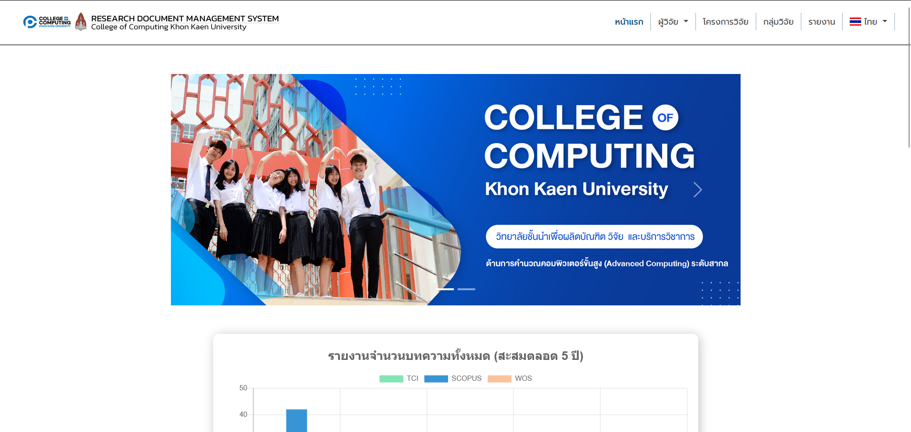
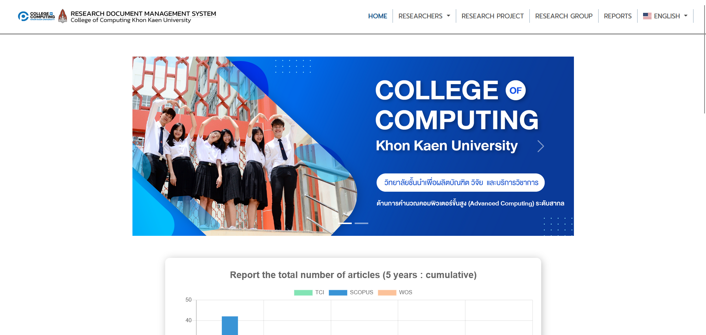
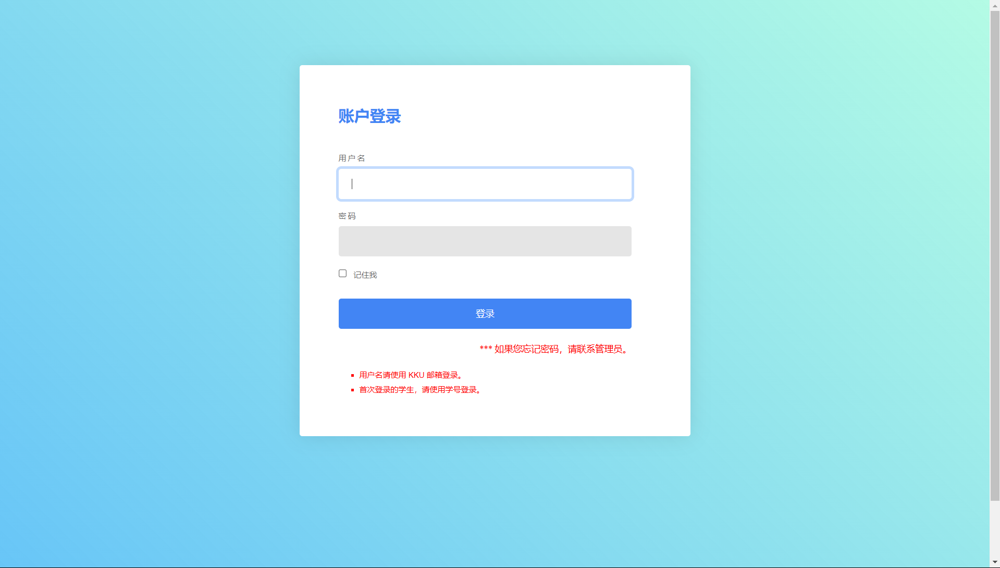
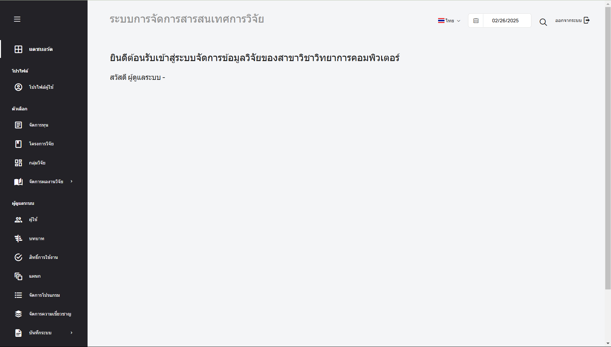
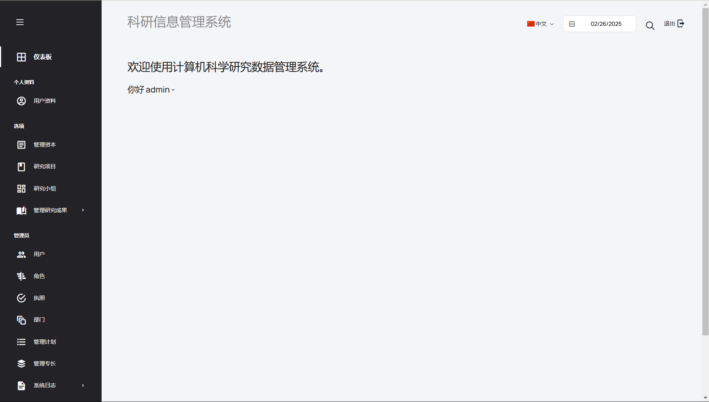

# Group 3 sec 4
- 643020626-6	นายพงศ์ปณต พร้อมสันเทียะ
- 653380191-9	นางสาวจีรวรรณ สิงห์กลิ่น
- 653380188-8	นายกิติพงษ์ ปักษีเลิศ
- 653380323-8	นางสาวมณิฐชญาณ์ ธมนันท์พงษา
- 653380319-9	นางสาวกัญญาพร ผิวนวล
- 653380209-6	นายพีรพัฒน์ สายยุทธ์
- 653380217-7	นางสาวสุธารยา คำขันธ์
# Sprint2
# **As a user,I want to switch language at all time.**
# คู่มือการใช้งาน (User Manual)
## เพิ่มปุ่มสลับภาษามี 3 ภาษา ดังนี้
- **ไทย**
- **อังกฤษ**
- **จีน**

#### หน้าหลักของระบบภาษาไทย เมื่อกดปุ่มสลับภาษาจะทำการเปลี่ยนเป็นภาษาตามที่เลือก

#### หน้าหลักของระบบภาษาอังกฤษ เมื่อกดปุ่มสลับภาษาจะทำการเปลี่ยนเป็นภาษาตามที่เลือก

#### หน้าหลักของระบบจีน เมื่อกดปุ่มสลับภาษาจะทำการเปลี่ยนเป็นภาษาตามที่เลือก

#### หน้าหลักที่แสดงผลเข้าสู่ระบบเป็นภาษาจีน เมื่อทำการกดปุ่มสลับภาษาแถบด้านบน

#### หน้าหลักของระบบภาษาไทย สำหรับนักวิจัยและผู้ดูแลระบบที่ต้องการจัดการข้อมูลเกี่ยวกับงานวิจัย

#### หน้าหลักของระบบภาษาอังกฤษ สำหรับนักวิจัยและผู้ดูแลระบบที่ต้องการจัดการข้อมูลเกี่ยวกับงานวิจัย

#### หน้าหลักของระบบภาษาจีน สำหรับนักวิจัยและผู้ดูแลระบบที่ต้องการจัดการข้อมูลเกี่ยวกับงานวิจัย

## เหตุการณ์ที่จะเป็นไปได้มีดังนี้
- สามารถเปลี่ยนภาษาจีนได้ทุกที่ภายในเว็บ ยกเว้นชื่องานวิจัย
- ในกรณีที่แก้ไขข้อมูล เมื่อเปลี่ยนภาษาข้อมูลที่ถูกแก้ไขต้องเปลี่ยนภาษาด้วย
- ถ้ามีการเพิ่มผู้วิจัยหรือเพิ่มอะไรใหม่ในเว็บ ต้องเปลี่ยนภาษาได้ด้วย
- เมื่อผู้ใช้ยังไม่ได้ล็อกอินเเล้วเปลี่ยนภาษา เมื่อกดเข้าไปหน้าล็อกอินควารจะเป็นภาษาล่าสุดที่เปลี่ยน เพื่อให้ผู้ใช้เข้าใจภาษาเพื่อที่จะล็อกอินได้
- ผู้ใช้ยังไม่ได้ล็อกอิน เปลี่ยนภาษาทั้งเว็บควรจะเป็นภาษานั้นทั้งหมด ถ้าผู้ใช้ออกหรือปิดเว็บก็จะถูกรีเป็นภาษาเริ่มต้น
- ผู้ใช้ล็อกอิน เมื่อเปลี่ยนภาษาก็จะเปลี่ยนstatusเปลี่ยนภาษาของผู้ใช้นั้นๆเมื่อปิดเว็บหรือล็อกเอ้าออก ภาษาก็จะไม่ถูกรีเว็ตเเละถ้าล็อกอินเข้ามาใหม่ก็ยังเป็นภาษาล่าสุดที่เปลี่ยน
