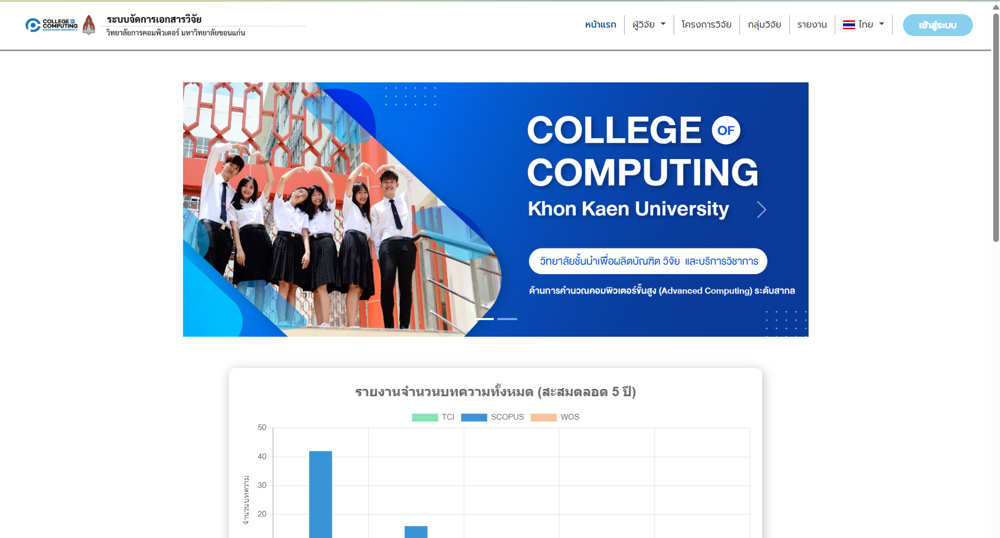
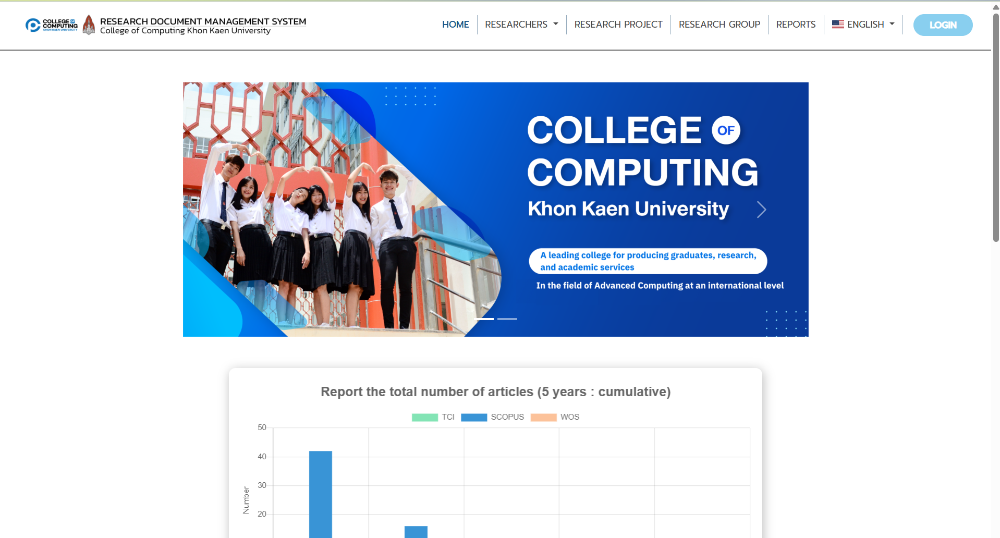
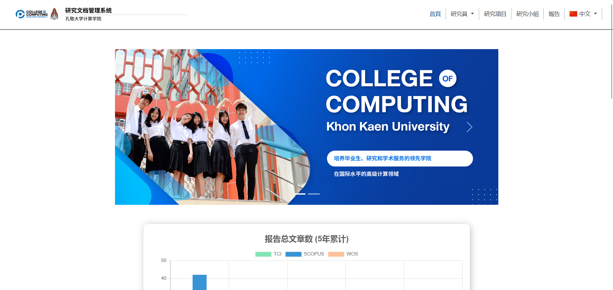
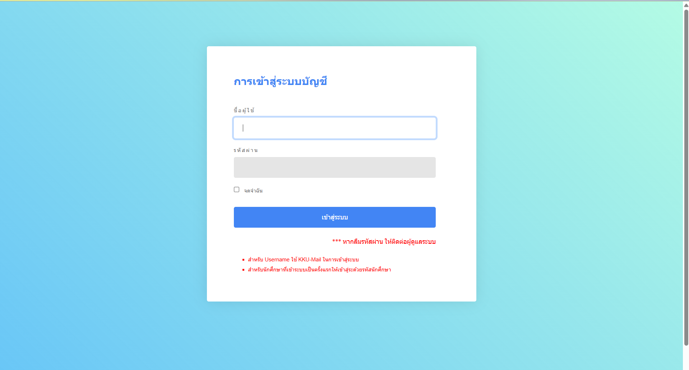
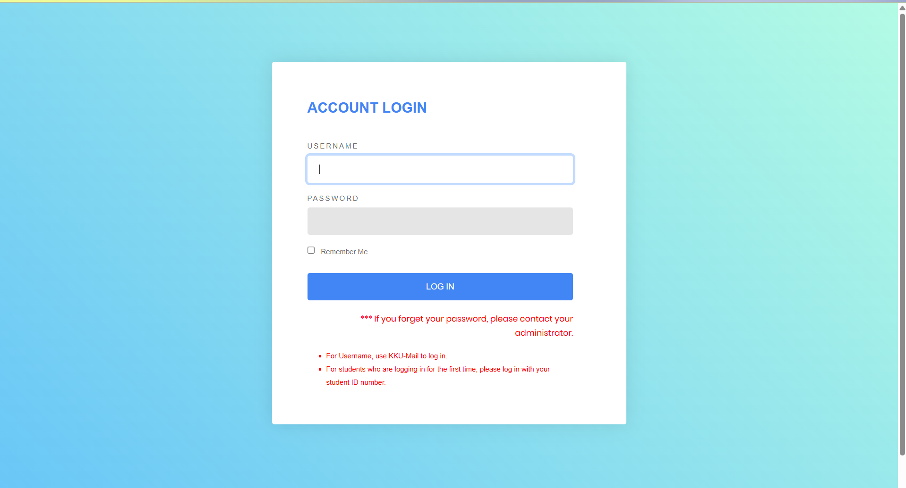
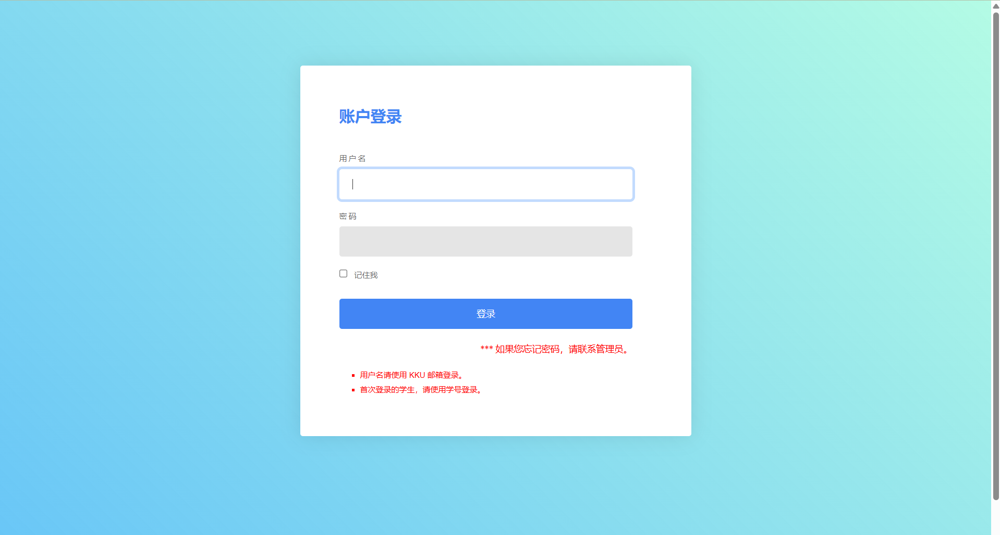
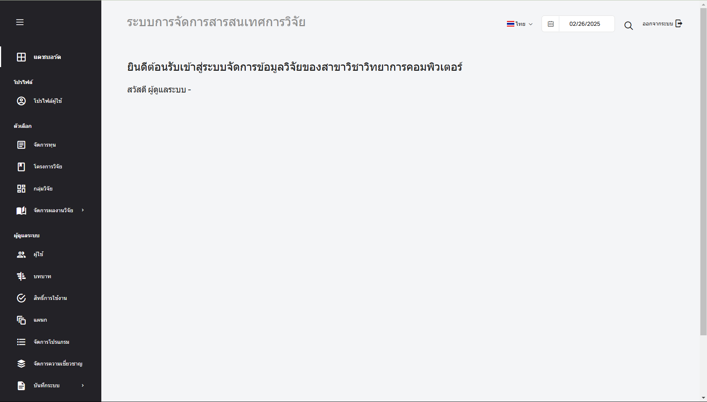
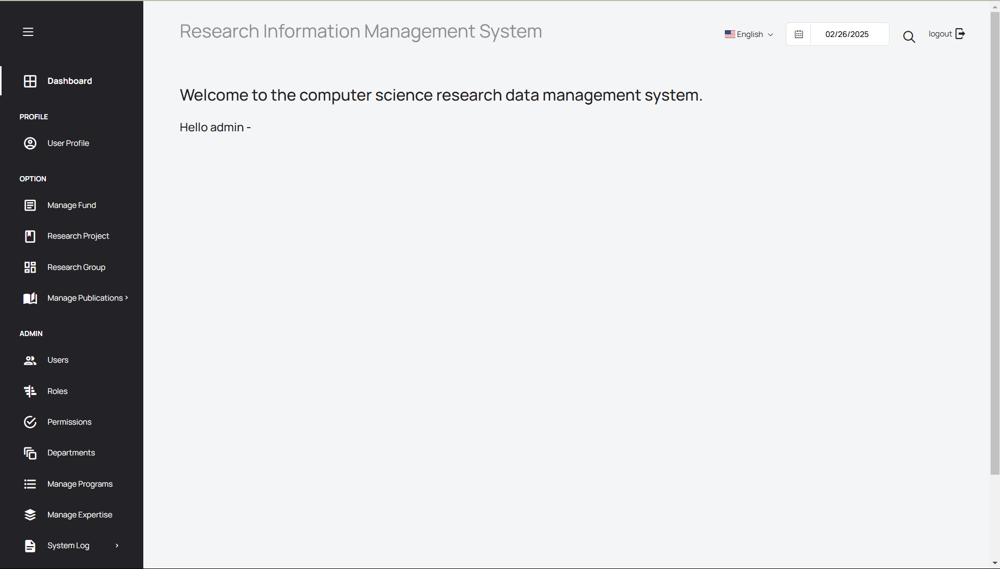

# Group 3 sec 4
- 643020626-6	นายพงศ์ปณต พร้อมสันเทียะ
- 653380191-9	นางสาวจีรวรรณ สิงห์กลิ่น
- 653380188-8	นายกิติพงษ์ ปักษีเลิศ
- 653380323-8	นางสาวมณิฐชญาณ์ ธมนันท์พงษา
- 653380319-9	นางสาวกัญญาพร ผิวนวล
- 653380209-6	นายพีรพัฒน์ สายยุทธ์
- 653380217-7	นางสาวสุธารยา คำขันธ์
# Sprint3
# **As a user,I want to switch language at all time.**
# คู่มือการใช้งาน (User Manual)
## ระบบนี้รองรับการใช้งานหลายภาษาเพื่อให้ผู้ใช้สามารถเลือกภาษาได้ตามความต้องการตลอดเวลา มีทั้งหมด 3 ภาษา ได้แก่
- **ไทย**
- **อังกฤษ**
- **จีน**

#### หน้าหลักของระบบภาษาไทย เมื่อกดปุ่มสลับภาษาจะทำการเปลี่ยนเป็นภาษาตามที่เลือก

#### หน้าหลักของระบบภาษาอังกฤษ เมื่อกดปุ่มสลับภาษาจะทำการเปลี่ยนเป็นภาษาตามที่เลือก

#### หน้าหลักของระบบจีน เมื่อกดปุ่มสลับภาษาจะทำการเปลี่ยนเป็นภาษาตามที่เลือก

#### หน้าหลักที่แสดงผลเข้าสู่ระบบเป็นภาษาไทย เมื่อทำการกดปุ่มสลับภาษาแถบด้านบน

#### หน้าหลักที่แสดงผลเข้าสู่ระบบเป็นภาษาอังกฤษ เมื่อทำการกดปุ่มสลับภาษาแถบด้านบน

#### หน้าหลักที่แสดงผลเข้าสู่ระบบเป็นภาษาจีน เมื่อทำการกดปุ่มสลับภาษาแถบด้านบน

#### หน้าหลักของระบบภาษาไทย สำหรับนักวิจัยและผู้ดูแลระบบที่ต้องการจัดการข้อมูลเกี่ยวกับงานวิจัย

#### หน้าหลักของระบบภาษาอังกฤษ สำหรับนักวิจัยและผู้ดูแลระบบที่ต้องการจัดการข้อมูลเกี่ยวกับงานวิจัย

#### หน้าหลักของระบบภาษาจีน สำหรับนักวิจัยและผู้ดูแลระบบที่ต้องการจัดการข้อมูลเกี่ยวกับงานวิจัย

## เหตุการณ์ที่อาจเกิดขึ้นในระบบ
- ผู้ใช้สามารถเปลี่ยนภาษาได้ตลอดเวลาภายในเว็บไซต์ ยกเว้นชื่อของงานวิจัย ซึ่งจะยังคงแสดงผลตามภาษาที่กำหนดไว้
- หากมีการแก้ไขข้อมูลภายในระบบ เมื่อเปลี่ยนภาษา ข้อมูลที่ถูกแก้ไขควรเปลี่ยนตามภาษาที่เลือก
- ข้อมูลที่เพิ่มใหม่ เช่น รายชื่อผู้วิจัย หรือเนื้อหาอื่น ๆ ควรรองรับการเปลี่ยนภาษาได้
- หากผู้ใช้ยังไม่ได้ล็อกอินและทำการเปลี่ยนภาษา เมื่อเข้าสู่หน้าล็อกอิน ระบบควรแสดงภาษาล่าสุดที่เลือกไว้ เพื่อให้ผู้ใช้เข้าใจข้อมูลได้อย่างถูกต้อง
- หากผู้ใช้ไม่ได้ล็อกอินและเปลี่ยนภาษา ระบบควรเปลี่ยนภาษาทั้งเว็บไซต์ให้สอดคล้องกับภาษาที่เลือก และหากผู้ใช้ออกจากระบบหรือปิดเว็บไซต์ ระบบควรรีเซ็ตเป็นภาษาดีฟอลต์เมื่อเข้าใช้งานใหม่
- หากผู้ใช้ล็อกอินและเปลี่ยนภาษา ระบบควรบันทึกค่าภาษาที่เลือกเป็นค่าปัจจุบันของบัญชีผู้ใช้นั้น และเมื่อล็อกเอาต์หรือปิดเว็บไซต์ ระบบควรคงค่าภาษาล่าสุดไว้เมื่อเข้าสู่ระบบอีกครั้ง
